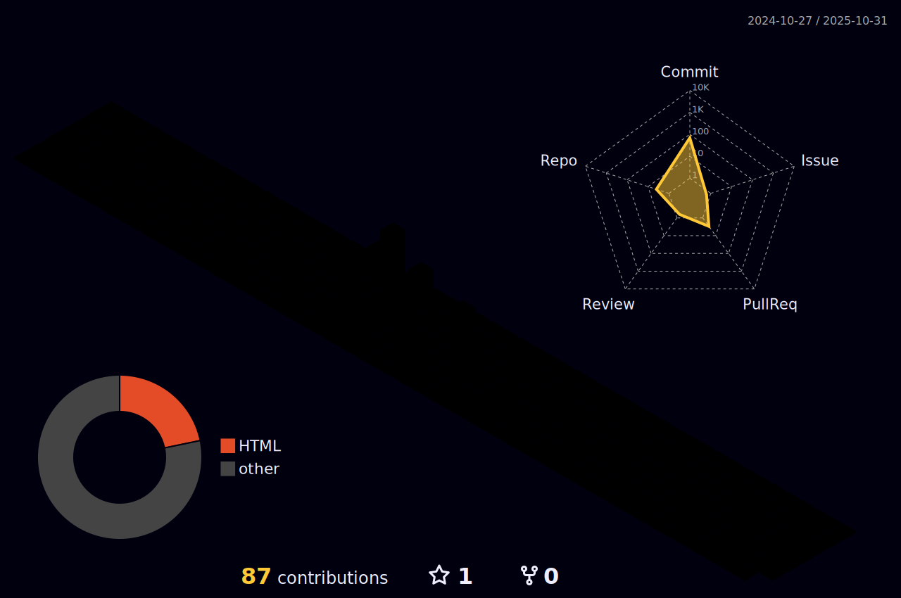

[;Nice+to+see+you)](https://git.io/typing-svg)

Here are some ideas to get you started:

- 🔭 I’m currently working on DJTU
- 🌱 I’m currently learning software
- 👯 I’m looking to collaborate on hangzhou
- 🤔 I’m looking for help with sutdying
- 💬 Ask me about music

### 我的技术栈：

  

